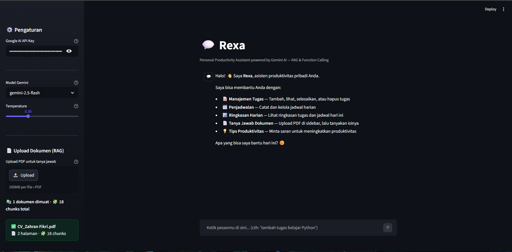

<div align="center">

# Rexa — Personal Productivity Assistant

<div style="display: flex; gap: 10px; flex-wrap: wrap; justify-content: center; margin-bottom: 20px;">
  
  
  
  
  
</div>

</div>

Rexa is an intelligent, AI-powered productivity assistant built with the **Gemini API**. It is designed to assist with daily organization, task management, scheduling, and deep information retrieval from PDF documents via a **Retrieval-Augmented Generation (RAG)** pipeline.

The application leverages **Streamlit** for an interactive UI, the **Google GenAI SDK** for the LLM engine and Function Calling, and an in-memory RAG architecture utilizing Cosine Similarity.




---

## Features

### 1. Smart Chat & Function Calling (Agentic AI)
Rexa executes actions automatically based on conversational context using Gemini's **Automatic Function Calling**:
*   **Task Management**: Add, view, complete, delete, and prioritize tasks.
*   **Scheduling**: Record daily schedules, view today's agenda, and remove canceled events.
*   **Daily Summaries**: Generate comprehensive overviews of pending tasks and upcoming schedules.
*   **Productivity Guidance**: Provide actionable advice based on established productivity methodologies (e.g., Pomodoro, Time Blocking).

### 2. Document Q&A (RAG Pipeline)
Extract insights from lengthy PDF files (e.g., journals, resumes, manuals):
*   **Streamlit Integration**: Drag-and-drop PDF uploads directly via the sidebar.
*   **Multi-File Support**: Upload multiple PDFs to accumulate knowledge within a single session.
*   **Smart Retrieval**: Automatically detects document-related queries and retrieves relevant context before generating an answer.
*   **Architecture**: Built using `PyPDFLoader`, `RecursiveCharacterTextSplitter`, `gemini-embedding-2`, and In-Memory Cosine Similarity.

### 3. Modern Streamlit UI
*   Dark Mode configuration (`.streamlit/config.toml`).
*   Sidebar controls for API Key configuration, model selection (`gemini-2.5-flash` or `gemini-2.0-flash`), and document uploads.
*   Responsive chat history interface.
*   Real-time visual indicators for task and schedule statuses.

---

## Project Structure

```text
📁 Final Project/
├── 📄 streamlit_chatbot.py    # Main Streamlit application entry point
├── 📄 requirements.txt        # Python dependencies
├── 📄 .env.example            # Environment variables template
├── 📄 .gitignore              # Git ignore rules
├── 📁 utils/                  # Core application modules
│   ├── 📄 __init__.py         # Python package marker
│   ├── 📄 llm.py              # Gemini Client & Chat Session initialization
│   ├── 📄 prompts.py          # Persona definitions & RAG templates
│   ├── 📄 rag.py              # PDF extraction, Embedding, & Retrieval logic
│   └── 📄 tools.py            # Function definitions for Agentic actions
├── 📁 RAG_dokumen/            # Directory for optional pre-loaded PDFs
└── 📁 .streamlit/
    └── 📄 config.toml         # Streamlit UI theme configuration
```

---

## Installation & Setup

### 1. Prerequisites
*   Python 3.10 or newer.
*   Google Gemini API Key. Obtainable from [Google AI Studio](https://aistudio.google.com).

### 2. Clone & Install Dependencies
```bash
# Clone the repository
git clone <repository-url>
cd <repository-folder>

# Create a virtual environment (recommended)
python -m venv venv

# Activate the virtual environment
# On Windows:
venv\Scripts\activate
# On Mac/Linux:
source venv/bin/activate

# Install required packages
pip install -r requirements.txt
```

### 3. Environment Variables
Create a `.env` file in the root directory (alongside `streamlit_chatbot.py`) and add the API Key:
```env
GEMINI_API_KEY="AIzaSy_YOUR_API_KEY_HERE"
```
*(Note: The API Key can also be inputted directly via the application's sidebar).*

### 4. Run the Application
```bash
streamlit run streamlit_chatbot.py
```
The application will launch in the default web browser (typically at `http://localhost:8501`).

---

## Usage Examples

Enter the following prompts in the chat interface to test the functionality:

**Task Management:**
*   *"Set a reminder for a meeting tomorrow at 2 PM, high priority."*
*   *"What are the pending tasks?"*
*   *"Mark the Python study task as completed."*

**Scheduling:**
*   *"Add a lunch schedule for 12:00 PM today."*
*   *"Show the agenda for today."*

**RAG (Document Q&A):**
*   *(Ensure a PDF is uploaded via the sidebar first)*
*   *"Based on the uploaded document, what is the work experience listed?"*
*   *"Summarize the contents of the PDF into 3 main points."*

---

## Troubleshooting
*   **Error 429 RESOURCE_EXHAUSTED**: Indicates the Gemini API Free Tier rate limit has been reached (20 requests/minute for the `2.5-flash` model). **Solution:** Wait approximately one minute before retrying, or switch the model to `gemini-2.0-flash` via the sidebar dropdown.
*   **RAG Pre-loaded Files**: PDFs can be registered to load automatically upon application startup by modifying the `RAG_DOCUMENTS` list within `utils/rag.py`.

---

## Development Context

*Developed for AI Development Final Project - Hacktiv8.*

### Key Learnings & Technologies Explored
This project serves as a comprehensive implementation of modern AI application development, demonstrating practical experience with:
*   **LLM Integration**: Direct implementation of the Google Gemini API for natural language understanding and generation.
*   **Agentic AI**: Utilizing Automatic Function Calling (Tools) to bridge LLM text generation with executable Python code logic.
*   **RAG Architecture (Retrieval-Augmented Generation)**: Building a custom document retrieval system without relying entirely on abstracted wrappers. This involves:
    *   Document loading and splitting (`PyPDFLoader`, `RecursiveCharacterTextSplitter`).
    *   Vector embedding utilizing Google GenAI.
    *   Manual implementation of Cosine Similarity via NumPy to circumvent environment-specific database limitations (e.g., SQLite threading issues in Streamlit).
*   **LangChain Fundamentals**: Understanding text chunking strategies and integrating LangChain components with direct SDK implementations.
*   **Web App Deployment**: Developing interactive, stateful web applications using Streamlit, including session state management for chat histories and background tasks.
